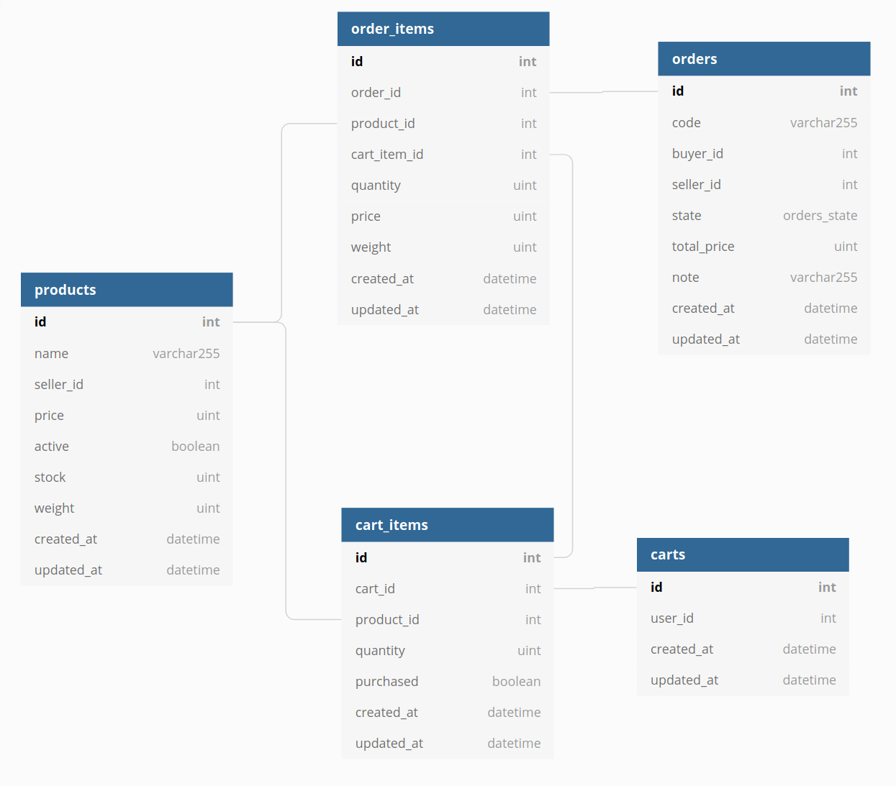

# WAITRESS

Waitress is PoC of microservice that simulate process order to handle race condition on database

## Problem

### Problem Condition

1. Inventory quantities are often misreported, and some items even go as far as having a negative inventory quantity.
2. The misreported items are those that performed very well on our 12.12 event.
3. Because of these misreported inventory quantities, the Order Processing department was unable to fulfill a lot of orders, and thus
requested help from our Customer Service department to call our customers and notify them that we have had to cancel their orders.

### Reason Happened

1. Bad checking algorithm for product stock when customers make their order
2. Bad database schema, because that not check when quantity less than 0. Minimum quantity value should 0
3. Occur race condition when update the stock when more than 1 customer make their order simultaneously

## Solution

### Offered Solution

1. Use database transaction with [pessimistic locking](https://stackoverflow.com/questions/129329/optimistic-vs-pessimistic-locking) on product to check product stock and update the stock to fulfil customer order. [implementation](./orders/repository/create.go#L23-L64)
2. Add constraint check on product stock. When stock less than zero, database will reject the update data. [implementation](./db/migrations/20210814104900_create_products.go#L19)
3. Add [pessimistic locking](https://stackoverflow.com/questions/129329/optimistic-vs-pessimistic-locking) on product to lock data at row level to prevent another proses update when application still have a process to update the data [implementation](./orders/repository/create.go#L37)

### Proof of the Solution

This project has a functional test to process 10 customers simultaneously to make their order with flow:
1. Create product with 10 stock
2. Get cart id from every buyer
3. Add to cart for every buyer with cart id from flow number 2 with random quantity (between 1-3 quantity)
4. Process their order simultaneously


## Installation

### Dependencies

This project have dependencies:
- GO 1.15
- POSTGRESQL 13

### Prerequisite

1. Install [REL CLI](https://go-rel.github.io/migration/#running-migration) for database migration

## Running

### With docker

1. Prepare `.env`
```
cp env.sample .env
```
2. Running docker-compose
```
docker-compose up
```
3. Prepare database schema
```
rel migrate
```
### Without docker

1. Prepare `.env`
```
cp env.sample .env
```
2. Running docker-compose
```
make run_api
```
3. Prepare database schema
```
rel migrate
```

### Functional Test
1. Run the server
2. Run the script
```
make order_test
```

## Project Structure

```
.
├── app
|   ├── api
│   │   ├── main.go
│   ├── handler
│   │   ├── order.go
│   │   └── [other handler].go
├── config
│   ├── log.go
│   └── [other config].go
├── db
│   └── migrations
│       └── [migration file]
├── docs
│   ├── docs.go
│   └── [other documentation]
├── domain
│   ├── order.go
│   └── [other domain].go
├── functional_test
│   └── main.go
├── orders
|   ├── repository
│   │   ├── create.go
│   │   ├── repository.go
│   │   └── [other repository].go
│   ├── usecase
│   │   ├── create.go
│   │   └── usecase.go
│   │   └── [other usecase].go
├── [other domain]
|   ├── [other repository]
│   │   └── [other repository].go
│   ├── [other usecase]
│   │   └── [other usecase].go
```

## Schema



For detail schema you can check on [migrations](./db/migrations) or [db diagram](https://dbdiagram.io/d/611665df2ecb310fc3ca64ee)

## API Documentations

For all available API you can check documentations on [docs.json](./docs/docs.json) to get the documentation of the API. Use [editor.swagger.io](https://editor.swagger.io/) to get the visual ui
